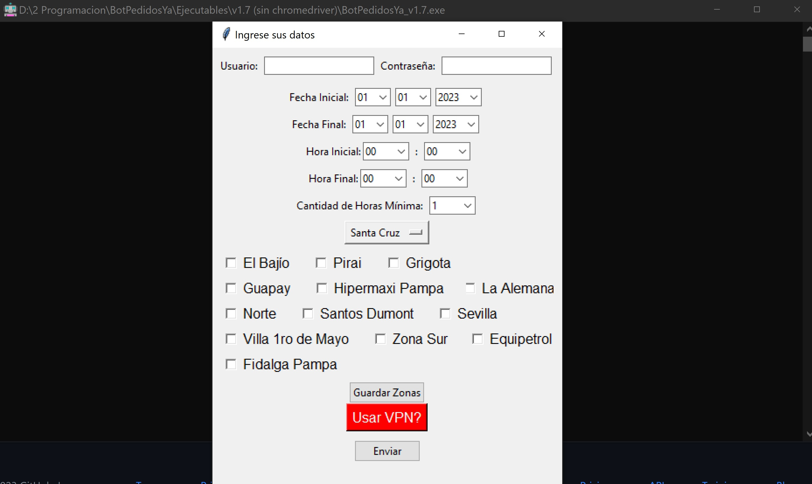

# Bot_Auto_Agenda_v1.3-Interfaz_Gráfica
Una pequeña actualización del bot que agenda turnos para realizar pedidos en PedidosYa.

## Actualizaciones v1.10:
- Se reparo algunos errores de flujo respecto al choque entre cuentas al tomar un mismo horario
- Se reparo un bug al situarse entre semanas, ahora el bot recorre el mes de forma mas natural y eficiente
- Se implementó la opcion de utilizar proxys en lugar de VPN
- Todas las anteriores
## Nuevas Funcionalidades v1.7:
- Ya no se requiere de chromedriver para funcionar
- Se agregó soporte para usar VPN y de esa forma generar múltiples conexiones desde distintas direcciones.
- Se agregó una interfaz gráfica para utilizar todo de forma más interactiva.
- Se añadió la opción de desplazamiento por todo el mes, permitiendo que el bot se desplace de semana a semana.
- Se mejoró la eficiencia al tomar los turnos.
- Cada ventana de conexión que genere el bot tiene su propia dirección IP para evitar baneos.
## Contactos:
Si te gusta mi trabajo o estás buscando consultoría para tus proyectos, Pentesting, servicios de RED TEAM - BLUE TEAM, implementación de normas de seguridad e ISOs, controles IDS - IPS, gestión de SIEM, implementación de topologías de red seguras, entrenamiento e implementación de modelos de IA, desarrollo de sistemas, Apps Móviles, Diseño Gráfico, Marketing Digital y todo lo relacionado con la tecnología, no dudes en contactarme al +591 75764248 y con gusto trabajare contigo.
